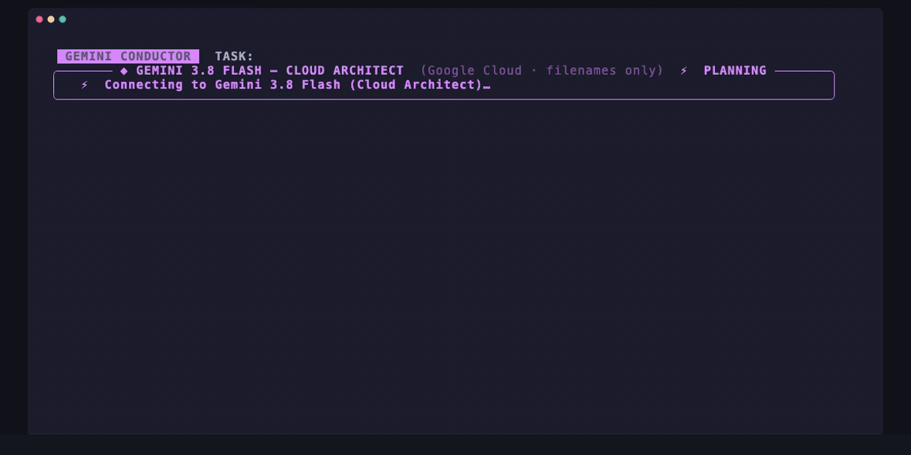

<div align="center">


<br/>

[](https://ai.google.dev/)
[-24C1E0?style=for-the-badge)](https://pypi.org/project/litert-lm/)

</div>

---



**Antigravity Hybrid Orchestrator** is a hybrid cloud/on-device security auditing and code-remediation tool built with [`google-antigravity`](https://pypi.org/project/google-antigravity/) and [`litert-lm`](https://pypi.org/project/litert-lm/). It pairs **Gemini 3.8 Flash** as a one-shot Cloud Chief Architect with **Gemma 4 26B** running locally on your own machine as an adversarial multi-agent remediation swarm.

Run it with zero arguments to launch the built-in built-in 3-file security audit, or point it at **your own Python files and test suite** with `--files` and `--test-cmd`.

---

## Why Gemini + Gemma?

A natural question when looking at a hybrid architecture is: **what is Gemini doing that local Gemma couldn't do on its own, and what actually leaves my machine?**

### 1. Why Local Gemma Alone Isn't Enough on Multi-File Codebases

Each on-device **Gemma 4** turn runs inside an isolated, stateless 4,096-token context window ([`runtime_compat.py`](runtime_compat.py)) inspecting **one file at a time**. Without cross-module architectural direction:
- When asked to fix a race condition in `billing.py`, an unconstrained local model frequently refactors module-level state (`balances`) into a class (`BillingService`), silently breaking callers and imports across the rest of the repository.
- Local builders benefit substantially when given an explicit **CWE root-cause hypothesis** and **synchronization/remediation primitive** before generating candidate rewrites.

### 2. What Is Sent to Gemini (AST Signatures Only — 0 Bytes of Function Bodies or Secrets)

Before calling **Gemini 3.8 Flash**, [`extract_public_skeleton()`](hybrid_orchestrator.py) parses each target file with Python's `ast` module and extracts **only** module imports, global variable names, and function/class signatures — stripping 100% of function bodies, SQL queries, and string literals (such as hardcoded API keys):

```text
▸ SENT TO GEMINI (extracted via ast.parse — 0 bytes of implementation bodies or secret literals):
  • auth.py:     imports=[os] globals=[FALLBACK_SECRET] defs=[def get_key()]
  • billing.py:  imports=[time] globals=[balances] defs=[def debit(user_id, amount)]
  • database.py: imports=[sqlite3] globals=[] defs=[def find_user(conn, username)]
```

Notice that `'sk-live-prod-9948'` in `auth.py` and the raw `SELECT * FROM users WHERE ...` query in `database.py` **never leave your machine**.

### 3. What Gemini Responds With (The Architectural Blueprint)

From those ~50 tokens of AST signatures, **Gemini 3.8 Flash** infers the vulnerability pattern across the codebase and returns a structured JSON blueprint (~150 tokens) containing three fields per file:
1. **`role`** — The diagnosed CWE / vulnerability class (e.g. `CWE-362 Race`, `CWE-89 SQLi`, `CWE-798 Secret`).
2. **`strategy`** — The exact remediation mechanism local Gemma builders must implement.
3. **`invariant`** — The public API contract (module globals and function signatures) that local Gemma builders are forbidden from breaking.

```json
[
  {
    "file": "auth.py",
    "role": "CWE-798 Secret",
    "strategy": "Remove FALLBACK_SECRET and raise RuntimeError when JWT_SECRET_KEY is unset or empty.",
    "invariant": "Preserve get_key() -> str signature."
  },
  {
    "file": "billing.py",
    "role": "CWE-362 Race",
    "strategy": "Guard check-and-deduct with a module-level threading.Lock() and reject non-positive amounts.",
    "invariant": "Preserve module-level balances dict and debit(user_id, amount) signature."
  },
  {
    "file": "database.py",
    "role": "CWE-89 SQLi",
    "strategy": "Replace f-string SQL interpolation with parameterized '?' placeholders.",
    "invariant": "Preserve find_user(conn, username) signature."
  }
]
```

Once Gemini emits this blueprint, **the cloud session goes `IDLE`**. Every remaining step — reading the full private source files, authoring competing patches (`Builder A` vs `Builder B`), judging candidates (`Blind Critic`), and iterating against the test suite — runs **100% on-device on Gemma 4, with no further cloud calls**.

---

## Architecture & Agent Cast

| Persona | Model & Runtime | Input Context | Responsibility | Token Share |
| :--- | :--- | :--- | :--- | :--- |
| **◆ Cloud Architect** | `Gemini 3.8 Flash`<br/>(`LocalAgentConfig`) | **AST skeletons only**<br/>(`imports`, `globals`, `defs`) | Diagnoses CWE class (`role`), prescribes fix (`strategy`), and locks API contract (`invariant`), then goes **`IDLE`**. | ~150 cloud tokens<br/>*(~2–4% of run)* |
| **◈ Red-Team Probe** | Subprocess Runner<br/>([`verification_tests.py`](sandbox/verification_tests.py) or `--test-cmd`) | Local target module | Executes the verification suite against the unpatched code first to **prove the vulnerability is real**. | Local CPU |
| **◈ Builder A (`minimal`)** | `Gemma 4 26B`<br/>(`LiteRTAgentConfig`) | Full private source + Gemini Blueprint + failure trace | Authors the smallest surgical patch that satisfies Gemini's `strategy` and `invariant`. | On-device |
| **◈ Builder B (`defensive`)** | `Gemma 4 26B`<br/>(`LiteRTAgentConfig`) | Full private source + Gemini Blueprint + failure trace | Authors a defensive rewrite with explicit input guards and invariants. | On-device |
| **◈ Blind Critic** | `Gemma 4 26B`<br/>(`LiteRTAgentConfig`) | Shuffled `Candidate 1` vs `Candidate 2` + Gemini Blueprint | Evaluates both patches **blind** (labels stripped, order deterministically shuffled) and selects the safer candidate. | On-device |

```text
   CLOUD ARCHITECT (Gemini 3.8 Flash)
   ┌─────────────────────────────────────────────────────────────────────────┐
   │  Sent:     AST skeletons only (imports + globals + defs; 0 secrets)     │
   │  Returns:  JSON Blueprint -> { role, strategy, invariant } (~150 tok)   │
   └───────────────────────────────────┬─────────────────────────────────────┘
                                       │  Blueprint locked (Cloud goes IDLE)
   ════════════════════════════════════╪══════════════════════════════════════
   ON-DEVICE SWARM (Gemma 4 26B · on-device) ▼              0 source lines uploaded
   ┌─────────────────────────────────────────────────────────────────────────┐
   │  For each target file (sandbox or custom --files):                      │
   │                                                                         │
   │   [1. Prove Bug] ──► Run test suite; must FAIL before patching starts   │
   │         │                                                               │
   │         ├──► ◈ Builder A (minimal)   ──┐                                │
   │         │                              ├──► Strip labels & shuffle      │
   │         └──► ◈ Builder B (defensive) ──┘              │                 │
   │                                                       ▼                 │
   │   [4. Verify]    ◄── Write winner ◄── ◈ Blind Critic picks #1 or #2     │
   │         │                                                               │
   │         ├──► ✔ All checks green?  ──► FILE VERIFIED GREEN               │
   │         └──► ✗ Still failing?     ──► Revert to best-known-good & retry │
   └─────────────────────────────────────────────────────────────────────────┘
```

---

## Run It on Your Own Code (`--files` & `--test-cmd`)

`antigravity-hybrid-orchestrator` is not locked to the 3 built-in sandbox files. You can point both the headless CLI (`--minimal`) and the live Rich HUD at **any Python module(s) and test command** (`pytest`, `unittest`, or a standalone test script):

```bash
# Headless console mode on your own module and test suite:
./run.sh --minimal \
  --files path/to/rate_limiter.py \
  --test-cmd "pytest tests/test_rate_limiter.py"

# Full interactive Rich HUD dashboard on your own module(s):
./run.sh \
  --files path/to/rate_limiter.py path/to/session_store.py \
  --test-cmd "pytest tests/" \
  --task "Audit & fix concurrency and input validation flaws"
```

### Live Output on an External Module (`rate_limiter.py`)

```text
[1/2] Cloud Architect (Gemini 3.8 Flash) — AST-Skeleton Uplink (0 bytes of bodies/secrets)
      ▸ SENT TO GEMINI (extracted via ast.parse — no implementation bodies or secret literals):
        • imports=[time] globals=[buckets] defs=[def allow_request(client_id, cost)]
      ✔ GEMINI RESPONDED WITH (~211 cloud tokens; 0 source lines leaked):
        • rate_limiter.py → [CWE-362]
          ├─ Strategy:  Guard bucket mutations with a thread lock and validate cost > 0 to prevent race conditions and quota inflation.
          └─ Invariant: allow_request(client_id, cost)
      ⏸ Cloud session is now IDLE. Handing off blueprint to local Gemma 4...

[2/2] On-Device Verification Swarm (Gemma 4 26B · on-device)
  ✗ rate_limiter.py [CWE-362] reproduced flaw: AssertionError: Negative cost allowed caller to inflate rate-limit quo…
  ▸ rate_limiter.py Builder (minimal) authored 16-line patch
  ▸ rate_limiter.py Builder (defensive) authored 24-line patch
  ⚖ rate_limiter.py Blind Critic picked #2 (defensive): 2 - Implements locking and input validation; Candidate 1 allows negati…
  ✔ rate_limiter.py VERIFIED GREEN (1/1 adversarial checks passed)

==========================================================================
RUN COMPLETE — 1/1 files verified green
Token split (estimated) — Cloud: 211 tok (13.6%) | On-Device: 1,335 tok (86.4%)
==========================================================================
```

---

## Built-In Demo Quickstart

### 1. Clone & set your API key

```bash
git clone https://github.com/google-gemma/cookbook.git
cd cookbook/apps/antigravity-hybrid-orchestrator
export GEMINI_API_KEY="your-gemini-api-key"
```

Without a key, the tool still runs using a built-in offline blueprint and marks the HUD accordingly so you always know whether a live cloud call occurred.

### 2. Preview the HUD immediately (no model or API key required)

```bash
./run.sh --snapshot
```

### 3. Download a Gemma 4 checkpoint & run the live audit

```bash
python3 tools/fetch_model.py --model 26b    # ~15.8 GB — recommended (MoE: ~4B active params/tok)
python3 tools/fetch_model.py --model 12b    # ~6.0 GB
python3 tools/fetch_model.py --model e4b    # ~3.0 GB
python3 tools/fetch_model.py --model e2b    # ~2.0 GB  — most compact checkpoint
```

```bash
./run.sh --minimal        # Linear console output showing exact Gemini input/output & Gemma patches
./run.sh                  # Full 12fps Rich split-screen terminal dashboard
MODEL=e2b ./run.sh        # Run with the compact E2B checkpoint
```

---

## Requirements

| Requirement | Details |
| :--- | :--- |
| **Python** | Python 3.10+ (bootstrapped automatically into `.venv` by `run.sh`) |
| **Runtime** | `litert-lm` selects an available accelerator at runtime and falls back to CPU, so throughput varies by machine |
| **Memory** | Scales with the checkpoint you pick: `gemma4-e2b` is the lightest option, `gemma4-26b` (`26B-A4B` Mixture-of-Experts, read-only `mmap`-backed) is the heaviest |
| **Disk** | ~2.0 GB (`e2b`), ~3.0 GB (`e4b`), ~6.0 GB (`12b`), or ~15.8 GB (`26b`) under `~/.litert-lm/models/gemma4-<size>/model.litertlm` |
| **Cloud** | `GEMINI_API_KEY` from [Google AI Studio](https://aistudio.google.com/apikey) |

Set `MODEL` to choose a checkpoint (`26b`, `12b`, `e4b`, `e2b`), `LITERT_MODEL_PATH`
to point at a specific file, or `LITERT_MODEL_DIR` to relocate the search root.

---

## Project Structure

```text
antigravity-hybrid-orchestrator/
├── quickstart_minimal.py     # Linear SDK console runner (supports --files & --test-cmd)
├── hybrid_orchestrator.py    # Main orchestrator, AST skeleton extractor & 3-lane async swarm
├── hud.py                    # 100×28 Rich terminal dashboard (◆ Gemini + ◈ Gemma hero panels)
├── runtime_compat.py         # LiteRT-LM adapter for stateless, thinking-free 4K turns
├── checkpoint.py             # Pre-flight presence check for .litertlm model checkpoints
├── sandbox/
│   └── verification_tests.py # Built-in adversarial test suite (auth, billing, database)
└── tools/
    └── fetch_model.py        # Resumable HuggingFace checkpoint downloader (26b, 12b, e4b, e2b)
```

---

## Honest Limitations

- **Token counts are estimates for local turns.** `litert-lm` does not return token usage metadata, so local tokens are approximated at ~4 characters/token (`~` in the HUD). Cloud tokens use the API's `usage_metadata` when available.
- **No cost measurement.** The tool reports the cloud/on-device token split only; it does not price API usage.
- **AST skeleton privacy scope.** `extract_public_skeleton()` strips all function bodies, docstrings, and constant literals before calling Gemini, meaning only `import` names, top-level variable names, and `def`/`class` signatures are transmitted.
- **Subprocess verification runs with user privileges.** Verification imports and executes the patched Python module in a local subprocess without container or syscall sandboxing. Use a container when running against untrusted repositories.
- **Non-deterministic local sampling.** Each file lane runs up to `MAX_LANE_LOOPS=5` rounds, automatically reverts any candidate patch that fails to improve the passing test count, and exits non-zero if any file remains unfixed.

---

## License

Licensed under the [Apache License, Version 2.0](LICENSE); see [`NOTICE`](NOTICE).

---

This is not an officially supported Google product. This project is not eligible for the [Google Open Source Software Vulnerability Rewards Program](https://bughunters.google.com/open-source-security).

